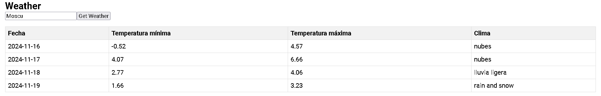

# PuntoDePagoFront

This project was generated with [Angular CLI](https://github.com/angular/angular-cli) version 18.2.12.

## Table of Contents

- [Technologies](#technologies)
- [Setup](#setup)
- [How To Use](#How-To-Use)

## Setup
  
### Clone the repository

```sh
  git clone https://github.com/FatFrogDev/punto-de-pago-front.git
  cd  punto-de-pago-front
```

### Install dependencies & start the server

````sh
  npm install
  ng serve
````

## How To Use

By default, the app will be running on `http://localhost:4200/`. <br>
The default endpoint will retrieve the information of "Bogotá" city. 
To change the city, you can type a value into the input of html, when clicking the button, the content of the table will be updated with the information of the city you typed.
Ex:
Default:


With city query:



Made with ❤️ by [FatFrogDev](https://github.com/FatFrogDev)
